# ggscala2

A Scala package that produces plots using R ggplot2.

## Getting Started


```scala
%AddDeps org.ddahl rscala_2.11 2.3.1
import org.ddahl.rscala._
%AddDeps com.climate ggscala2_2.11 0.0.3 --repository file:/Users/ricardo.lemos/scala_jars/
import com.climate.ggscala2.Gigi
Gigi.inline = Some((h: String) => kernel.magics.html(h)) // method that converts html into an inline figure in Toree
Gigi.screenScale = 0.25 // smaller inline plots
```

    Marking org.ddahl:rscala_2.11:2.3.1 for download
    Preparing to fetch from:
    -> file:/var/folders/zx/tybg3qc92z13w8lp81mlr2rjzqbsdw/T/toree_add_deps1862492987876009503/
    -> https://repo1.maven.org/maven2
    -> New file at /var/folders/zx/tybg3qc92z13w8lp81mlr2rjzqbsdw/T/toree_add_deps1862492987876009503/https/repo1.maven.org/maven2/org/ddahl/rscala_2.11/2.3.1/rscala_2.11-2.3.1.jar
    Marking com.climate:ggscala2_2.11:0.0.3 for download
    Preparing to fetch from:
    -> file:/var/folders/zx/tybg3qc92z13w8lp81mlr2rjzqbsdw/T/toree_add_deps1862492987876009503/
    -> file:/Users/ricardo.lemos/scala_jars/
    -> https://repo1.maven.org/maven2
    -> New file at /Users/ricardo.lemos/scala_jars/com/climate/ggscala2_2.11/0.0.3/ggscala2_2.11-0.0.3.jar


Use the following code to render an example plot:


```scala
Gigi("example = ggplot(data.frame(x = 1, y = 2), aes(x = x, y = y)) + geom_point()")
Gigi.print("example")
```

<p align="center">
  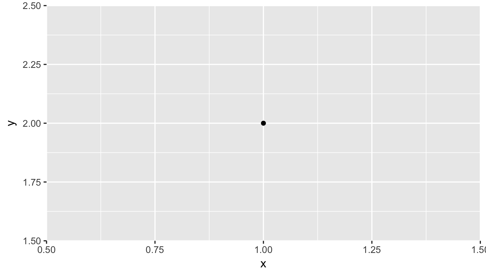
</p>

Gigi is the name of the package's only object, which you call to plot.

### Prerequisites

You need the software *R* (https://www.r-project.org/) installed in your machine. 
You also need the *R* packages *ggplot2* and *grid*: in an R terminal, type

```R
install.packages("ggplot2")
install.packages("grid")
```

To confirm that an *R* interpreter can be instantiated from Scala, try 

```scala
val R = org.ddahl.rscala.RClient()
```

If that does not work, *ggscala2* has a workaround: type  

```scala
Gigi.path2r = "/path/to/R/here"
```
early in your Scala code, to point *rscala* in the right direction.

## Plotting in ggscala2

There are several built-in types of plots in this package:

### Line plot

The instruction


```scala
Gigi.lineplot(y = Array(1.3, 2.3, 4.5, 1.7))
```

<p align="center">
  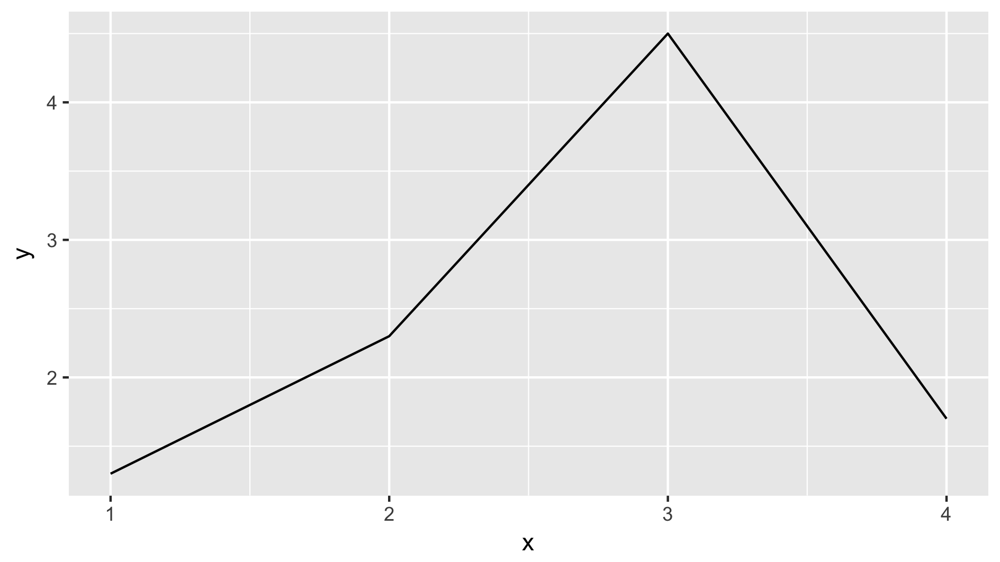
</p>


produces a simple line plot; at the other extreme,


```scala
Gigi.lineplot(x = Option(Array(1.0, 2.0, 1.0, 2.0)),
  y = Array(1.3, 2.3, 4.5, 1.7),
  z = Option(Array("g1", "g1", "g2", "g2")),
  xlab = "predictor", ylab = "response", zlab = "group", title = "ggscala2 lineplot",
  drawPoints = true)
```

<p align="center">
  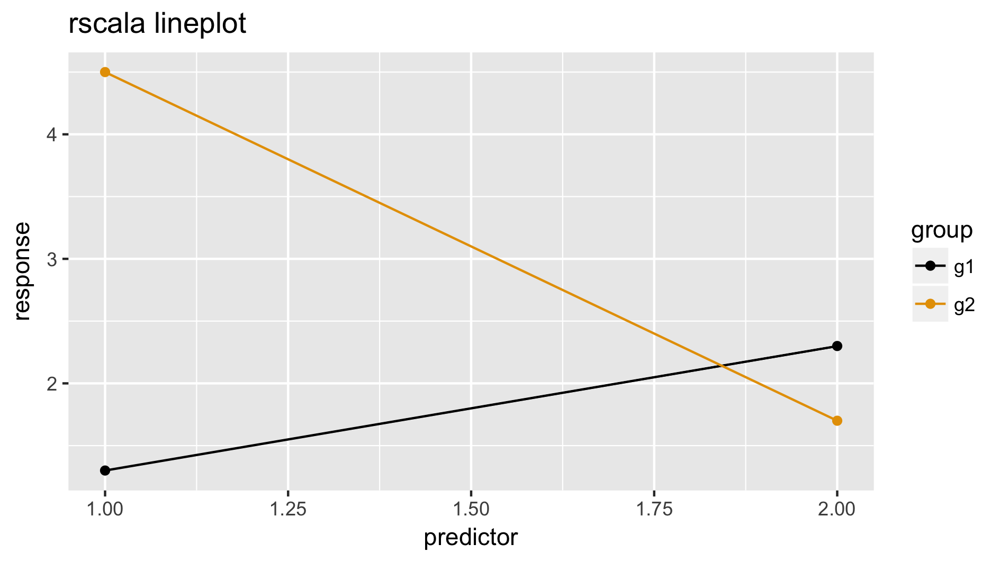
</p>


demonstrates all the features you can include in a lineplot.

### Scatter plot

Under the hood, *ggscala2* employs the same method to build line and scatter plots. 
End users, however, use a different call


```scala
Gigi.scatterplot(x = Array(1.0, 2.0, 1.0, 2.0),
  y = Array(1.3, 2.3, 4.5, 1.7),
  z = Option(Array("g1", "g1", "g2", "g2")),
  xlab = "predictor", ylab = "response", zlab = "group", title = "ggscala2 scatterplot")
```

<p align="center">
  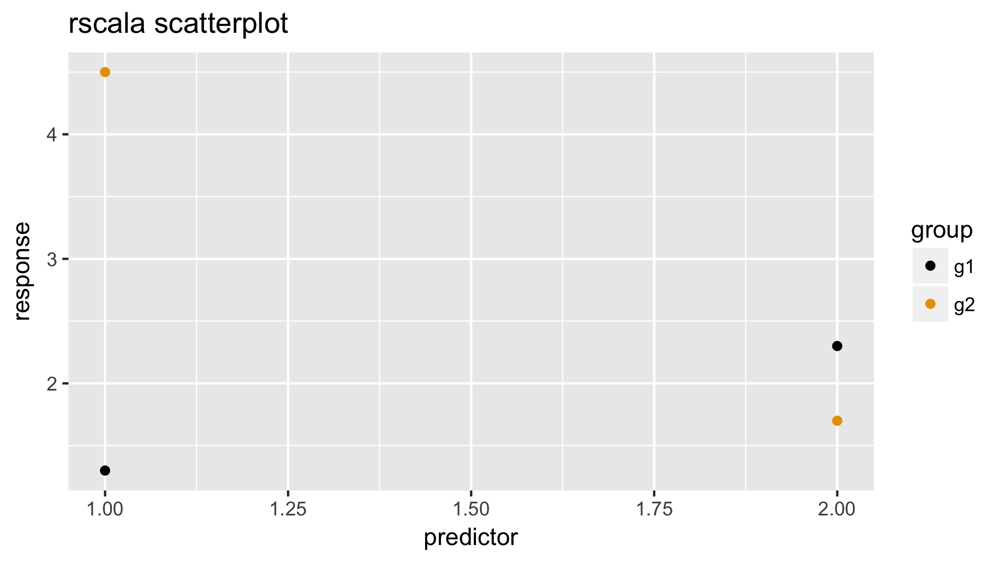
</p>


### Time series plot

Deceptively similar to line plots, 
time series plots let you add confidence bands to the 
representation of a single variable whose 
distribution (mean, variance, etc.) changes over time. 
If you also have observations, you can add them using the argument `z`.


```scala
import org.joda.time.DateTime
val x: Array[DateTime] = Array("1980-01-15", "1980-01-16", "1980-01-17", "1980-01-18").map(new DateTime(_))
```


```scala
Gigi.timeseriesplot(x = x,
  y = Array(1.3, 2.3, 4.5, 1.7),
  z = Option(Array(1.4, 1.6, 3.6, 1.6)),
  ymin = Option(Array(0.7, 1.7, 3.6, 1.0)),
  ymax = Option(Array(1.7, 2.7, 5.6, 2.0)),
  xlab = "date", ylab = "response", title = "ggscala2 timeseries plot")
```

<p align="center">
  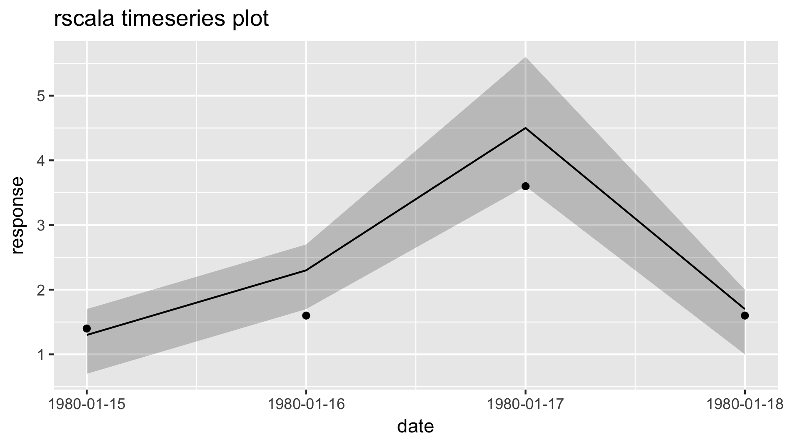
</p>


### Density plot

Here you can compare the distribution of several random variables,
for which you have samples: stack them all in a single array, `x`, and
use `z` to identify the variables.


```scala
Gigi.densityplot(x = Array(1.0, 2.0, 2.1, 2.6, 0.7, 1.2, 1.4, 2.0),
  z = Option(Array("v1", "v1", "v1", "v1", "v2", "v2", "v2", "v2")),
  xlab = "", zlab = "variable", title = "ggscala2 densityplot")
```

<p align="center">
  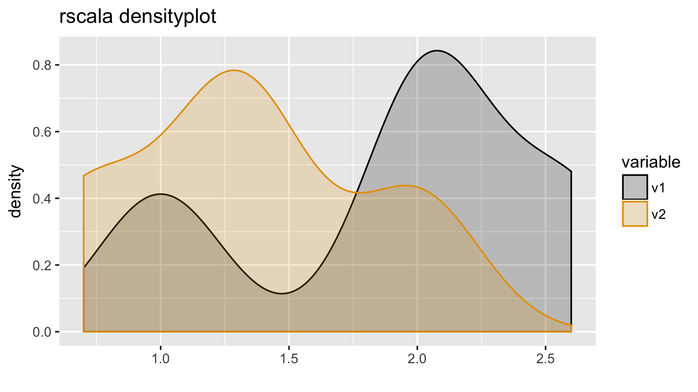
</p>


### Surface plot

To draw a simple 2D surface plot, do


```scala
Gigi.surfaceplot(x = Array(1.0, 2.0, 3.0, 1.0, 2.0, 3.0, 1.0, 2.0, 3.0),
  y = Array(1.0, 1.0, 1.0, 2.0, 2.0, 2.0, 3.0, 3.0, 3.0),
  z = Array(1.2, 2.3, 3.4, 1.4, 2.1, 2.8, 1.1, 2.0, 3.7),
  xlab = "longitude", ylab = "latitude", zlab = "height")
```

<p align="center">
  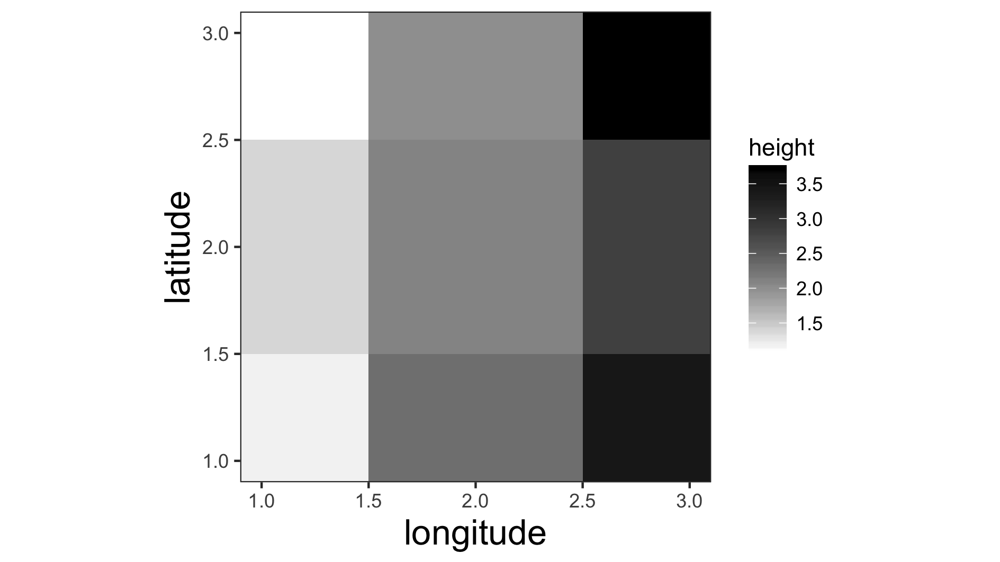
</p>


The color scheme changes automatically if z includes negative and positive values


```scala
Gigi.surfaceplot(x = Array(1.0, 2.0, 3.0, 1.0, 2.0, 3.0, 1.0, 2.0, 3.0),
  y = Array(1.0, 1.0, 1.0, 2.0, 2.0, 2.0, 3.0, 3.0, 3.0),
  z = Array(-1.2, 2.3, 3.4, -1.4, 2.1, 2.8, -1.1, 2.0, 3.7),
  xlab = "longitude", ylab = "latitude", zlab = "height")
```

<p align="center">
  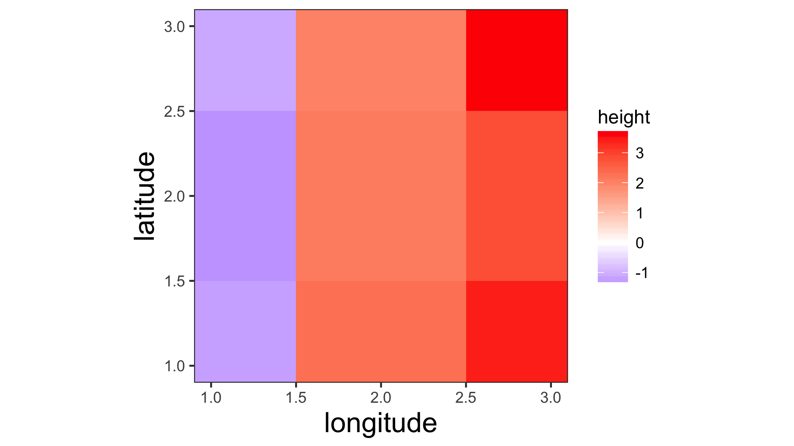
</p>


You can add as many layers to a surface plot as you would like. For example, here
we overlay a surface with a contour, vectors, points, and text.


```scala
val x = Array(1.0, 2.0, 3.0, 1.0, 2.0, 3.0, 1.0, 2.0, 3.0)
val y = Array(1.0, 1.0, 1.0, 2.0, 2.0, 2.0, 3.0, 3.0, 3.0)
val z = Array(-1.2, 2.3, 3.4, -1.4, 2.1, 2.8, -1.1, 2.0, 3.7)
Gigi.surfaceplot(
  layerType = List("surface", "contour", "vectors", "points", "text"),
  x = List(x, x, x, x, x),
  y = List(y, y, y, y, y),
  z = List(z, z, x.map(_ * 0.1) ++ y.map(_ * 0.1), z.map(_ * 0.5), z),
  text = Option(z.map(_.toString)),
  xlab = "longitude", ylab = "latitude", zlab = "height")
```

<p align="center">
  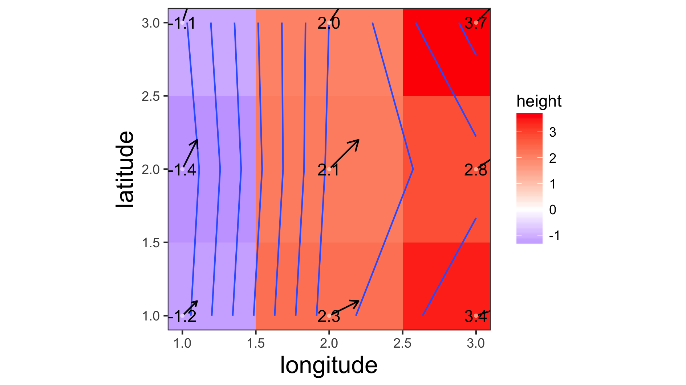
</p>


### Reliability plot

To draw a Brier Score reliability plot (a.k.a. reliability diagram), do


```scala
Gigi.reliabilityplot(x = Array(0.1, 0.2, 0.1, 0.5, 0.3, 0.8, 0.9, 0.8, 0.05, 0.0, 0.99, 0.2), 
  y = Array(false, false, false, false, false, false, true, true, false, false, true, false))
```

<p align="center">
  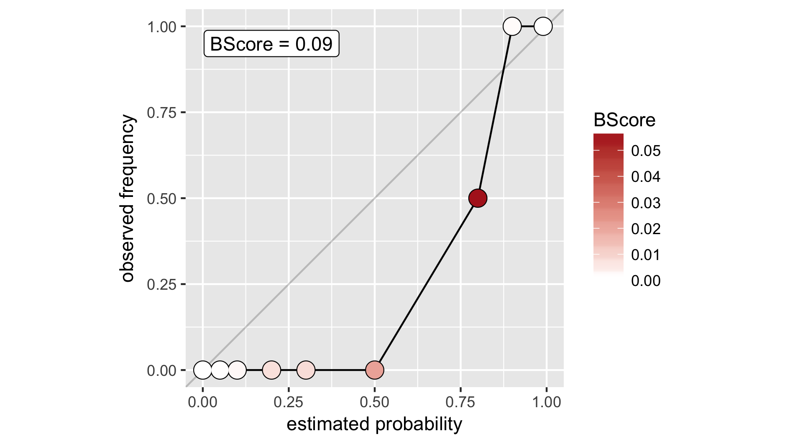
</p>


### Multipanel figures

There is a straightforward way of creating multipanel figures


```scala
Gigi.split(2,2)
Gigi.spool("lineplot", Option(0), Option(0))
Gigi.spool("timeseriesplot", Option(0), Option(1))
Gigi.spool("scatterplot", Option(1), Option(0))
Gigi.spool("densityplot", Option(1), Option(1))
Gigi.print()
```

<p align="center">
  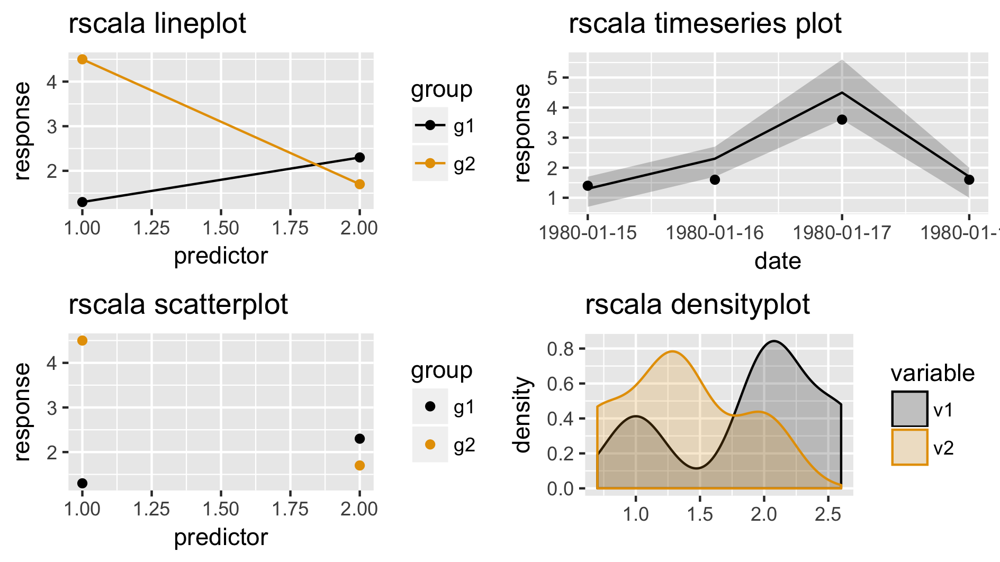
</p>


### Manual edits to built-in plots

Not pleased with the look of your built-in plot? Ask Gigi to change it.


```scala
Gigi("densityplot = densityplot + theme(legend.position='bottom')")
Gigi.print("densityplot")
```

<p align="center">
  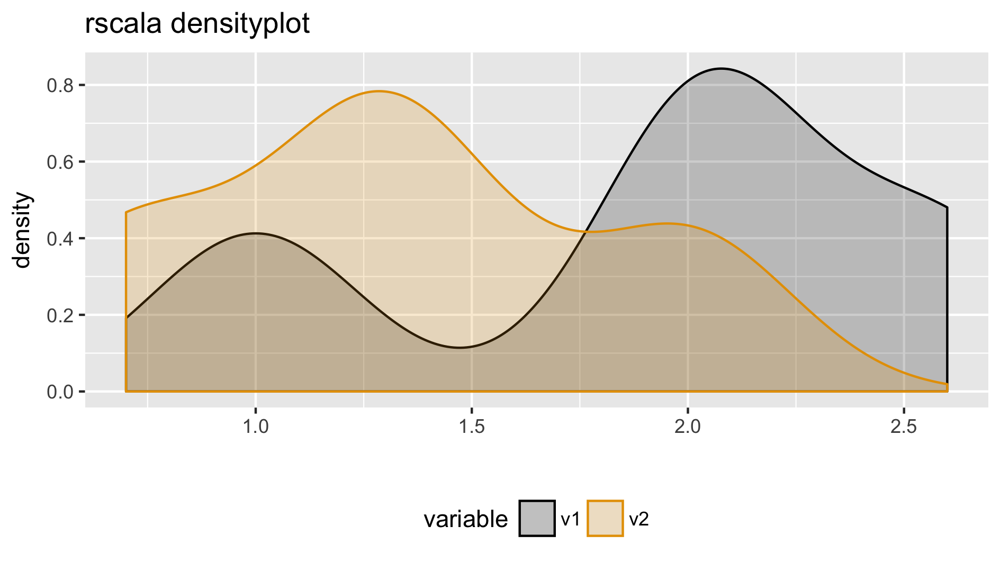
</p>


You can change the color palettes for your plots:


```scala
Gigi.paletteZeroExtreme.changeColor(Array("yellow", "dark green"))
Gigi.changePalettes() // to activate change
Gigi.surfaceplot(x = Array(1.0, 2.0, 3.0, 1.0, 2.0, 3.0, 1.0, 2.0, 3.0),
  y = Array(1.0, 1.0, 1.0, 2.0, 2.0, 2.0, 3.0, 3.0, 3.0),
  z = Array(1.2, 2.3, 3.4, 1.4, 2.1, 2.8, 1.1, 2.0, 3.7),
  xlab = "longitude", ylab = "latitude", zlab = "height")
```

<p align="center">
  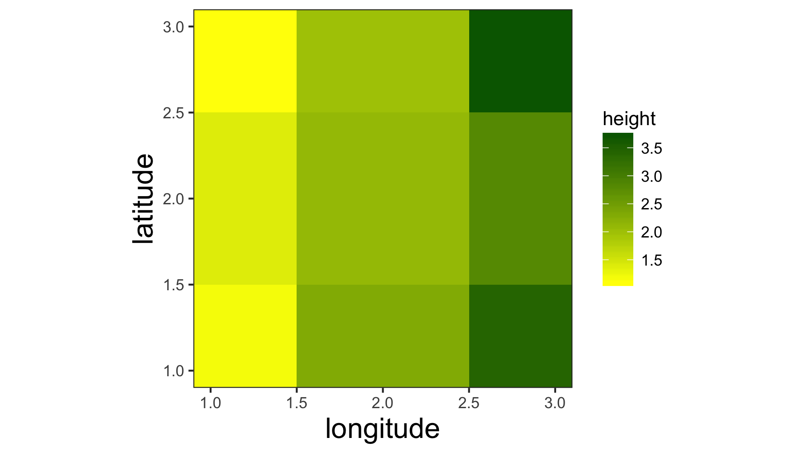
</p>


Similar operations can be applied to `paletteLine`, `paletteFill`, and
`paletteNegZeroPos`.

### Build your own plots

In the "Getting started" section we saw that it is possible to create a simple 
plot by sending all the *R* commands to Gigi. You can also plot data from your
Scala session, using the `set` method, and you are not limited to the types of
plots displayed above -- any instruction recognized by *ggplot2* is available. 


```scala
Gigi.set("x", Array(1,1,2,3,3,3,3,4,4,4,4,4,5,5,5,5,5,5,6,6,6,7,7,7,7,8,8,9,9))
Gigi("myplot = ggplot(data.frame(x=x), aes(x=x)) + geom_histogram(binwidth=2)")
Gigi.print("myplot")
```

<p align="center">
  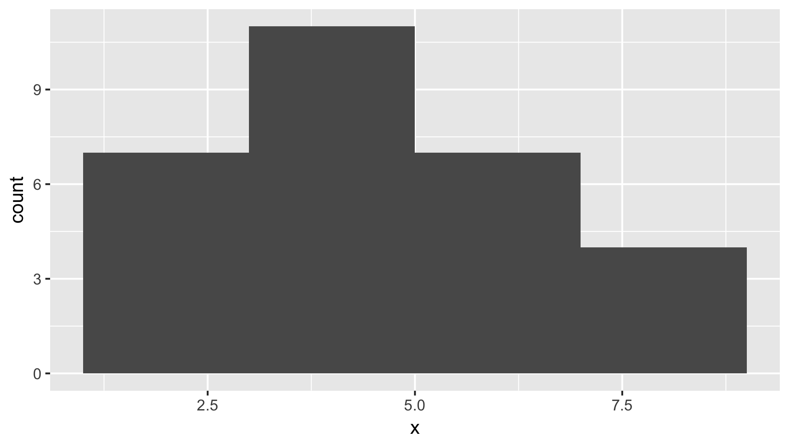
</p>


## Authors

* **Ricardo Lemos** - *Initial work* - [The Climate Corporation](http://www.climate.com)

## License

Apache 2.0
